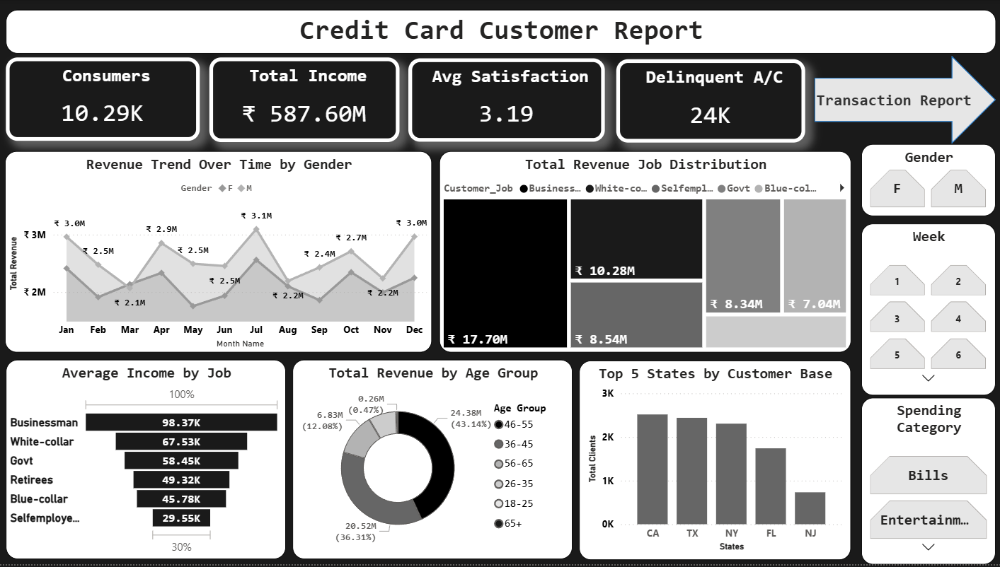
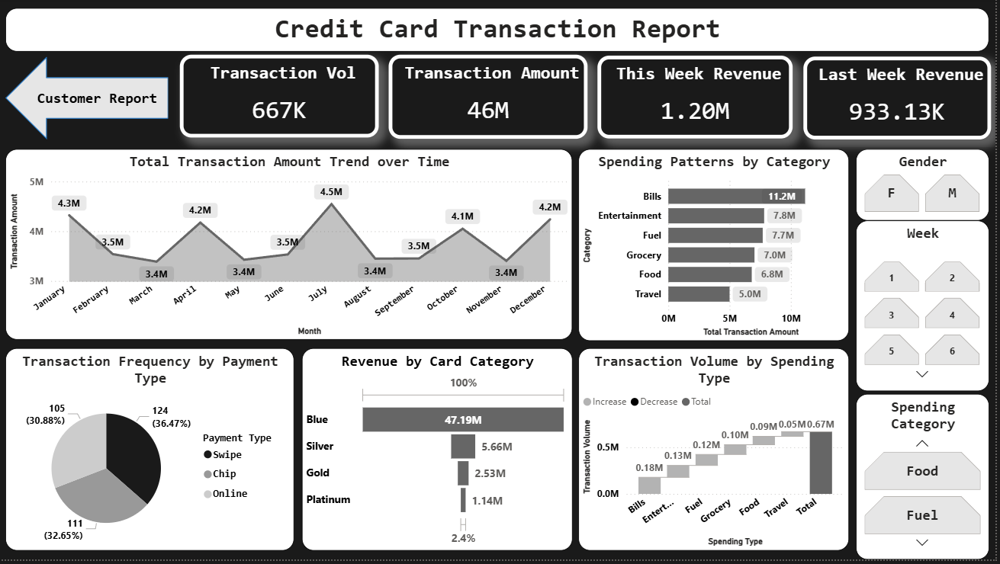

# Credit Card Weekly Status Report

## Overview
I am highly enthusiastic to present the Credit Card Weekly Status Report, an advanced Power BI analytics project designed to transform raw customer and transaction datasets into actionable business intelligence. This project delivers a dynamic, interactive reporting suite that provides deep insights into customer demographics, spending behaviors, and transaction frequencies, enabling data-driven decision-making for credit card portfolio management.

## Problem Statement
The primary objective was to develop a comprehensive monitoring solution for credit card performance. The existing data was divided into distinct customer profiles and transactional logs, making it difficult to analyze spending patterns across different demographic segments. The project required the creation of an interactive reporting tool that could seamlessly filter metrics by gender, age, income, and specific timeframes, while accurately calculating complex week-over-week financial growth indicators.

## Analysis Done
A rigorous data modeling and engineering approach was implemented to ensure accurate and dynamic visualizations. The core analytical phases included:

* **Data Modeling:** Established a robust relational model by integrating the customer demographic dataset with the credit card transaction dataset utilizing the primary key.
* **Customer Segmentation:** Engineered custom calculated columns using DAX to categorize customers into distinct 'Age Groups' and 'Income Groups' (Low, Medium, High), facilitating granular demographic analysis.
* **Financial Metric Computation:** Developed critical DAX measures to track 'Total Revenue', 'Current Week Revenue', and 'Previous Week Revenue'. 
* **Data Transformation:** Successfully resolved a complex time-intelligence challenge where native week columns were formatted as text. Utilized the DAX SUBSTITUTE and VALUE functions to engineer a pure integer week column, enabling flawless previous week revenue calculations and MAX() operations.

## Dashboard
The final deliverable consists of two highly interactive, specialized Power BI dashboards that leverage advanced slicers and dynamic cross-filtering capabilities:

* **Dashboard 1: Credit Card Customer Report**
  Focuses on deep demographic breakdowns. It empowers users to explore the customer base through dedicated slicers for Gender, Age Group, and Income Group, providing a clear view of who the customers are and their financial standing.

  
* **Dashboard 2: Credit Card Transaction Report**
  Centers on spending patterns and operational frequencies. It features dynamic filters for Gender, Week, and Spending Category, allowing stakeholders to track exactly where and how transactions are occurring, including an analysis of preferred payment methods (Swipe, Chip, Online).

## Recommendations
Drawing from the interactive exploration of the data, the following strategic actions are highly recommended to maximize portfolio revenue and customer engagement:

* **Targeted Demographic Marketing:** The analysis clearly indicates that specific income brackets and education levels drive the majority of transaction volume. Marketing efforts should be heavily concentrated on acquiring and retaining these high-value demographic segments.
* **Gender-Optimized Campaigns:** With clear trends emerging in the 'Expenditure Type' category when filtered by gender, promotional campaigns and reward programs should be precisely tailored to align with the distinct spending allocations of male and female customers.
* **Payment Infrastructure Focus:** Since the majority of transaction volume is concentrated in specific payment methods like Swipe and Chip, ensuring seamless and highly secure infrastructure for these preferred methods is critical for maintaining high customer satisfaction and transaction completion rates.
